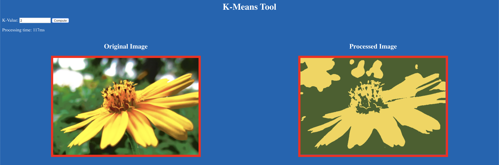
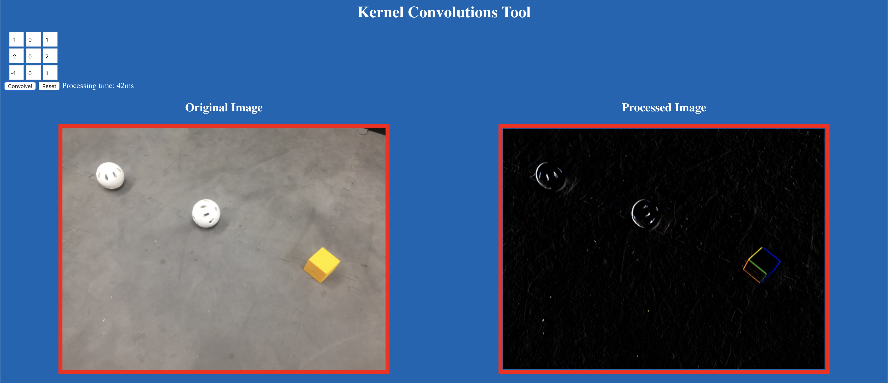

# Computer Vision Demo
Demo shown during the "Custom Vision Software in FTC" talk at the 2019 FTC World Championship Conference in Houston.

### How to Use
Install dependencies: `pip3 install flask`

Clone & Run:

```
git clone https://github.com/inventshah/FTC-Worlds2019-Vision-Demo.git
cd FTC-Worlds2019-Vision-Demo
python3 main.py
```

### K-Means Demos
Go to [localhost:3000/kmeans](localhost:3000/kmeans)


Enter a K-Value and press compute to see the result.

### Image Kernels Demo
Go to [localhost:3000/kernel](localhost:3000/kernel)


Enter a 3x3 Matrix and press Convolve! to see the result.

### Built With
* Python3
* JavaScript
* HTML
* CSS